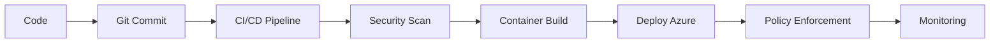

<!-- Banner Principal (sin "&" en el texto para evitar error XML en capsule-render) -->

  

<!-- Typing Animation -->

  

<!-- Flag -->

  

---

## 🌍 About Me | Sobre mí

### 🇬🇧 English
I'm a **DevSecOps & Cloud Security Engineer** focused on securing cloud platforms, automating infrastructure, and building secure CI/CD pipelines.  
I work with **Azure**, **Terraform**, **Docker**, and **GitHub Actions**, and develop backend solutions with **Java**, **Python**, **FastAPI**, and **Spring Boot**.  
I'm passionate about cloud governance, Policy-as-Code, and designing systems that are secure, compliant, and scalable from the start.  

💡 *Specialized in Azure Policy, RBAC, secure APIs with JWT, and enterprise IaC with Terraform & Terragrunt.*

---

### 🇪🇸 Español
Soy **Ingeniero DevSecOps y Seguridad en la Nube**, enfocado en asegurar plataformas cloud, automatizar infraestructura y construir pipelines CI/CD seguros.  
Trabajo con **Azure**, **Terraform**, **Docker** y **GitHub Actions**, y desarrollo backend con **Java**, **Python**, **FastAPI** y **Spring Boot**.  
Me apasiona la gobernanza cloud, Policy-as-Code y diseñar sistemas seguros, cumplidos y escalables desde el inicio.  

💡 *Especializado en Azure Policy, RBAC, APIs seguras con JWT e IaC empresarial con Terraform y Terragrunt.*

---

## 📫 Connect With Me | Contáctame

  
  
  

🚀 *Si el botón de correo no funciona, escríbeme a:*  
📧 **andrescabezase@outlook.com**

---

## 🛠️ Tech Stack | Tecnologías

### ⚙️ Backend  

### ☁️ Cloud & DevOps  

---

## 🎯 Core Skills | Habilidades Clave

  
  
  
  
  
  

---

## ✨ Highlights | Logros
- ☁️ **Cloud Security** — Azure Policy, RBAC, governance and compliance automation.  
- 🧱 **Infrastructure as Code** — Enterprise architectures with Terraform and Terragrunt.  
- 🔐 **DevSecOps** — Secure CI/CD pipelines with GitHub Actions and SonarCloud.  
- 🛡️ **Secure APIs** — REST APIs with FastAPI, Spring Boot and JWT authentication.  
- 📦 **Containers** — Docker-based workloads and secure deployments.  
- 🤖 **Automation** — Python scripting and backend development.  

---

## 🧭 DevSecOps Pipeline

---

## 🚀 Featured Projects | Proyectos Destacados  

| Proyecto | Descripción | Tecnologías |
|----------|-------------|-------------|
| *Próximamente* | Proyectos destacados de DevSecOps, cloud o backend. | Azure, Terraform, FastAPI, Spring Boot |

*Puedes explorar más en [mis repositorios](https://github.com/JesusAndres2512?tab=repositories).*

---

## 📊 GitHub Stats

  
  

  

---

## 🤝 Let's Collaborate | Colaboremos  
If you're looking for a **DevSecOps or Cloud Security** engineer to secure your infrastructure, automate deployments, or build secure pipelines — let's connect!  
Si buscas un ingeniero **DevSecOps o Seguridad en la Nube** para asegurar tu infraestructura, automatizar despliegues o construir pipelines seguros — ¡hablemos!

---

<!-- Footer -->

  

  <strong>Secure Cloud · Automate Everything · Trust Nothing</strong>

