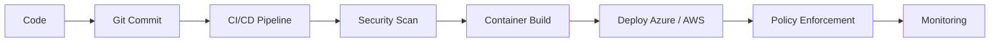

<!-- Banner Principal -->

  

<!-- Typing Animation -->

  

<!-- Flag -->

  

---

## 🌍 About Me | Sobre mí

### 🇬🇧 English
I'm a **Cloud Infrastructure Architect in Training** with a focus on **Cybersecurity and DevSecOps**. I specialize in designing and integrating secure solutions with **Azure**, **AWS**, and **Docker**, applying DevOps principles, automation, and Infrastructure as Code.  
Committed to the development and deployment of secure, resilient, and scalable applications — ensuring data protection, service continuity, and compliance with best practices in cybersecurity and secure cloud architecture.

💡 *Specialized in secure Azure & AWS architecture, IAM, access control, CI/CD pipelines, and secure APIs with JWT.*

---

### 🇪🇸 Español
Soy **Arquitecto de Infraestructura Cloud en Formación** con enfoque en **Ciberseguridad y DevSecOps**. Me especializo en el diseño e integración de soluciones seguras con **Azure**, **AWS** y **Docker**, aplicando principios de DevOps, automatización e infraestructura como código.  
Comprometido con el desarrollo y despliegue de aplicaciones seguras, resilientes y escalables, garantizando la protección de datos, continuidad del servicio y cumplimiento de buenas prácticas en ciberseguridad y arquitectura cloud segura.

💡 *Especializado en arquitectura segura Azure y AWS, IAM, control de accesos, pipelines CI/CD y APIs seguras con JWT.*

---

## 📫 Connect With Me | Contáctame

  
  
  

🚀 *Si el botón de correo no funciona, escríbeme a:*  
📧 **andrescabezase@outlook.com** | 📞 (+57) 314 229 8292 | 📍 Bogotá D.C., Colombia

---

## 🎓 Education | Educación

| Título | Institución | Período |
|--------|-------------|---------|
| 🎓 Ingeniería en Sistemas | Fundación Universitaria Los Libertadores – Bogotá D.C. | 2022 – Actualidad |
| 📄 Bachiller Académico | I.E.D. German Arciniegas – Bogotá D.C. | 2020 |

---

## 🛠️ Tech Stack | Tecnologías

### ⚙️ Backend  

### 🗄️ Databases | Bases de Datos

### ☁️ Cloud & DevOps  

---

## 🎯 Core Skills | Habilidades Clave

  
  
  
  
  
  
  
  

---

## ✨ Highlights | Logros
- 🏆 **Hackathon RiskTech 2025** — **1er Lugar** en soluciones tecnológicas con IA para prevención del fraude.
- ☁️ **Cloud Security** — Arquitectura segura en Azure y AWS, control de accesos, cifrado e IAM.
- 🧱 **Infrastructure as Code** — Arquitecturas empresariales con Terraform y Terragrunt.
- 🔐 **DevSecOps** — Pipelines CI/CD seguros con GitHub Actions y SonarCloud.
- 🛡️ **Secure APIs** — APIs REST con FastAPI, Spring Boot y autenticación JWT.
- 📦 **Containers** — Cargas de trabajo en Docker y despliegues seguros.
- 🔭 **NASA / IASC** — Contribución al análisis de imágenes Pan-STARRS para observación de asteroides.
- 🤖 **Automation** — Scripting en Python y desarrollo backend escalable.

---

## 🧭 DevSecOps Pipeline

```mermaid
flowchart LR

Code[Code]
Commit[Git Commit]
Pipeline[CI/CD Pipeline]
Scan[Security Scan]
Build[Container Build]
Deploy[Deploy Azure / AWS]
PolicyCheck[Policy Enforcement]
Monitor[Monitoring]

Code --> Commit
Commit --> Pipeline
Pipeline --> Scan
Scan --> Build
Build --> Deploy
Deploy --> PolicyCheck
PolicyCheck --> Monitor
```

---

## 🚀 Featured Projects | Proyectos Destacados  

| Proyecto | Descripción | Tecnologías |
|----------|-------------|-------------|
| [🐾 PetTrack](https://github.com/VettApps/PetTrack) | Plataforma modular de microservicios para gestión veterinaria. Integrada en la nube con autenticación JWT y API Gateway — entorno escalable y seguro. | FastAPI, ReactJS, JWT, API Gateway, Cloud DB |
| [🌦️ WeatherViewer](https://github.com/JesusAndres2512/WeatherViewer) | Aplicación móvil para monitoreo climático en tiempo real. | Kotlin, Android Studio |

*Puedes explorar más en [mis repositorios](https://github.com/JesusAndres2512?tab=repositories).*

---

## 📜 Certifications & Awards | Certificaciones y Premios

| Reconocimiento | Organización | Año |
|----------------|--------------|-----|
| 🥇 **1er Lugar — Hackathon RiskTech 2025** | RiskTech S.A.S / REDIS | 2025 |
| 🎤 Ponente — EIEI ACOFI / CLADI 2025 *(Machine Learning en Micromagnetismo Computacional)* | ACOFI / CONFEDI – Cartagena de Indias | 2025 |
| 🎤 Ponente — CICI 2025 *(Aplicación de Machine Learning en Magnetismo Computacional)* | Universidad Mariana – Pasto, Colombia | 2025 |
| 🔭 Colaborador — International Astronomical Search Collaboration (NASA / Pan-STARRS) | IASC / University of Hawaii | 2024 |
| 🛡️ Cyber Threat Management | Cisco Networking Academy | 2024 |
| 🔒 Endpoint Security | Cisco Networking Academy | 2024 |
| 🌐 Network Defense | Cisco Networking Academy | 2024 |

---

## 🧠 Soft Skills | Habilidades Blandas

  
  
  
  
  
  

---

## 🌐 Languages | Idiomas

| Idioma | Nivel |
|--------|-------|
| 🇪🇸 Español | Nativo |
| 🇬🇧 Inglés | B1 (en formación) |

---

## 📊 GitHub Stats

  

  

---

## 🤝 Let's Collaborate | Colaboremos  
If you're looking for a **Cloud Infrastructure / DevSecOps** engineer focused on cybersecurity to secure your infrastructure, automate deployments, or build secure pipelines — let's connect!  
Si buscas un ingeniero de **Infraestructura Cloud y DevSecOps** enfocado en ciberseguridad para asegurar tu infraestructura, automatizar despliegues o construir pipelines seguros — ¡hablemos!

---

<!-- Footer -->

  

  <strong>Secure Cloud · Automate Everything · Trust Nothing</strong>

