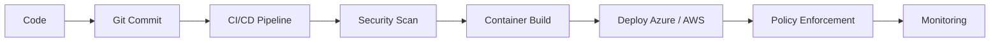
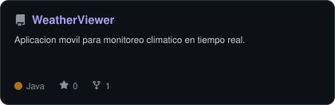
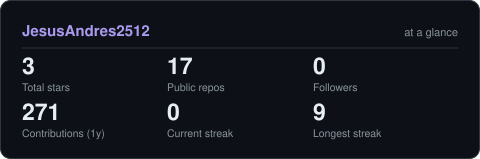

<!-- BANNER - terminal profile.sh --live (additive). Generated by scripts/banner/generate.py.
     ~0.85 MB each. Cache-bust with ?v=N after regenerating. -->
<picture>
  <source media="(prefers-color-scheme: dark)"  srcset="assets/banner-dark.v9.svg">
  <source media="(prefers-color-scheme: light)" srcset="assets/banner-light.v9.svg">
  
</picture>

 

<!-- NAME / TAGLINE - animated typing -->

 

<!-- SOCIALS -->
&nbsp;&nbsp;
&nbsp;&nbsp;

 

---

## This is me :)

Hi, I'm **Jesus Andres**, Cloud Infrastructure Architect in training with a focus on **Cybersecurity and DevSecOps**, based in Bogotá, Colombia 🇨🇴.
I design and integrate secure solutions on **Azure**, **AWS** and **Docker**, applying DevOps principles, automation and Infrastructure as Code — always with data protection, service continuity and secure architecture in mind.

- ☁️ **Cloud Security & IAM** — control de accesos, cifrado y arquitectura segura en Azure y AWS.
- 🔐 **DevSecOps** — pipelines CI/CD seguros con GitHub Actions, Jenkins y SonarCloud.
- 🧱 **Infrastructure as Code** — arquitecturas empresariales con Terraform y Terragrunt.
- 🛡️ **Secure APIs** — REST APIs con FastAPI y Spring Boot, autenticación JWT y API Gateway.
- 🏆 **1er lugar — Hackathon RiskTech 2025**, soluciones con IA para prevención de fraude.
- 🔭 **NASA / IASC** — colaborador en análisis de imágenes Pan-STARRS para observación de asteroides.
- 🎤 Ponente en **ACOFI EIEI 2025** y **CICI 2025** (Machine Learning en magnetismo computacional).
- 💬 Talk to me about **Cloud Security**, **DevSecOps** or **Infrastructure as Code**.

 

## my perfect stack

---

## signals

<table>
<tr>
<td width="50%" align="center" valign="middle">

<!-- Self-rated radar - edit assets/skills.json, the workflow redraws it -->
<picture>
  <source media="(prefers-color-scheme: dark)"  srcset="assets/radar-dark.svg">
  <source media="(prefers-color-scheme: light)" srcset="assets/radar-light.svg">
  
</picture>

</td>
<td width="50%" align="center" valign="middle">

<!-- Hand-authored language / cloud stack radar - edit assets/langmix.json -->
<picture>
  <source media="(prefers-color-scheme: dark)"  srcset="assets/radar-langs-dark.svg">
  <source media="(prefers-color-scheme: light)" srcset="assets/radar-langs-light.svg">
  
</picture>

</td>
</tr>
</table>

---

## 🧭 DevSecOps pipeline

```mermaid
flowchart LR

Code[Code]
Commit[Git Commit]
Pipeline[CI/CD Pipeline]
Scan[Security Scan]
Build[Container Build]
Deploy[Deploy Azure / AWS]
PolicyCheck[Policy Enforcement]
Monitor[Monitoring]

Code --> Commit
Commit --> Pipeline
Pipeline --> Scan
Scan --> Build
Build --> Deploy
Deploy --> PolicyCheck
PolicyCheck --> Monitor
```

---

## 🚀 Featured projects

| Project | Description | Stack |
|---------|-------------|-------|
| [🐾 PetTrack](https://github.com/VettApps/PetTrack) | Plataforma modular de microservicios para gestión veterinaria, integrada en la nube con autenticación JWT y API Gateway. | FastAPI, ReactJS, JWT, API Gateway |
| [🌦️ WeatherViewer](https://github.com/JesusAndres2512/WeatherViewer) | Aplicación móvil para monitoreo climático en tiempo real. | Kotlin, Android Studio |

<!-- Self-hosted repo card - stars/forks come live from the API. Renders once
     the "Charts and cards" workflow has run at least once. -->
<picture>
  <source media="(prefers-color-scheme: dark)"  srcset="assets/card-WeatherViewer-dark.svg">
  <source media="(prefers-color-scheme: light)" srcset="assets/card-WeatherViewer-light.svg">
  
</picture>

*Explora más en [mis repositorios](https://github.com/JesusAndres2512?tab=repositories).*

---

## 📜 Certifications & awards

| Recognition | Organization | Year |
|-------------|--------------|------|
| 🥇 1st place — Hackathon RiskTech 2025 | RiskTech S.A.S / REDIS | 2025 |
| 🎤 Speaker — EIEI ACOFI / CLADI 2025 *(Machine Learning en Micromagnetismo Computacional)* | ACOFI / CONFEDI — Cartagena de Indias | 2025 |
| 🎤 Speaker — CICI 2025 *(Aplicación de Machine Learning en Magnetismo Computacional)* | Universidad Mariana — Pasto | 2025 |
| 🔭 Contributor — International Astronomical Search Collaboration (NASA / Pan-STARRS) | IASC / University of Hawaii | 2024 |
| 🛡️ Cyber Threat Management | Cisco Networking Academy | 2024 |
| 🔒 Endpoint Security | Cisco Networking Academy | 2024 |
| 🌐 Network Defense | Cisco Networking Academy | 2024 |

---

## Numbers matter? ohhh yes.

<!-- Generated by scripts/cards.py into this repo. Deliberately NOT
     github-readme-stats / streak-stats / github-profile-trophy: those are
     shared public instances that go down and take the whole section with them.
     Renders once the "Charts and cards" workflow has run at least once. -->
<picture>
  <source media="(prefers-color-scheme: dark)"  srcset="assets/card-stats-dark.svg">
  <source media="(prefers-color-scheme: light)" srcset="assets/card-stats-light.svg">
  
</picture>

 

---

## 🌐 Languages

| Language | Level |
|----------|-------|
| 🇪🇸 Español | Nativo |
| 🇬🇧 English | B1 (en formación) |

---

## 🤝 Let's collaborate

If you're looking for a **Cloud Infrastructure / DevSecOps** engineer focused on cybersecurity to secure your infrastructure, automate deployments, or build secure pipelines — let's connect!
Si buscas un ingeniero de **Infraestructura Cloud y DevSecOps** enfocado en ciberseguridad para asegurar tu infraestructura, automatizar despliegues o construir pipelines seguros — ¡hablemos!

📧 **andrescabezase@outlook.com** · 📞 (+57) 314 229 8292 · 📍 Bogotá D.C., Colombia

---

` Secure Cloud · Automate Everything · Trust Nothing `

