<!-- ========================================================= -->
<!-- HEADER -->
<!-- ========================================================= -->

<h1 align="center">☁️ DevSecOps | Cloud Security Engineer</h1>

<p align="center">
Securing cloud platforms • Automating infrastructure • Building secure pipelines
</p>

<p align="center">


</p>

---

# 🧭 DevSecOps Architecture

```mermaid
flowchart LR

Dev[👨‍💻 Developer]
GitHub[📦 GitHub Repo]
Actions[⚙️ GitHub Actions CI/CD]
Sonar[🔎 SonarCloud Scan]
Docker[🐳 Docker Build]
TF[🌍 Terraform / Terragrunt]
Azure[☁️ Microsoft Azure]
Policy[🛡️ Azure Policy]
Monitor[📊 Monitoring & Logs]

Dev --> GitHub
GitHub --> Actions
Actions --> Sonar
Sonar --> Docker
Docker --> TF
TF --> Azure
Azure --> Policy
Policy --> Monitor
```



---

# ⚡ Tech Stack

| ☁️ Cloud | 🔐 Security | ⚙️ DevOps | 🧠 Backend | 🗄️ Database | 🤖 Automation |
|---|---|---|---|---|---|
| Azure | Azure Policy | GitHub Actions | Node.js | PostgreSQL | Python |
| AKS | JWT | CI/CD | FastAPI | Azure DB | Data Analysis |
| App Services | RBAC | Docker | REST APIs |  | Automation |
| Governance | Cloud Security | SonarCloud | Microservices |  |  |

---

# 🛡️ Cloud & Security Focus

| Area | Capabilities |
|---|---|
| ☁️ Cloud Governance | Azure Policy, Naming Standards, Tag Enforcement |
| 🔐 Identity & Access | RBAC, JWT, Secure Identity Design |
| 🧱 Infrastructure as Code | Terraform Enterprise Architecture |
| 🛡️ Cloud Security | Policy-as-Code, Compliance Automation |
| 🔎 DevSecOps | Secure CI/CD pipelines |
| 📦 Containers | Secure Docker workloads |
| 🌐 Distributed Systems | Secure service-to-service communication |

---

# 🚀 DevSecOps Pipeline


---

# 🧩 Infrastructure Architecture (Enterprise IaC)


---

# 📌 Featured Areas

| 🔹 Area | 🔧 Technologies |
|---|---|
| Cloud Governance | Azure Policy, RBAC |
| IaC Enterprise | Terraform, Terragrunt |
| Secure APIs | FastAPI, JWT |
| DevSecOps | GitHub Actions, SonarCloud |
| Containers | Docker |
| Automation | Python |

---

# 📊 GitHub Analytics

<p align="center">


</p>

---

# 🔥 GitHub Streak

<p align="center">


</p>

---

# 📈 Activity Graph

<p align="center">


</p>

---

# 🧠 Core Competencies

```text
Cloud Security        ████████████████████
Terraform / IaC      ████████████████████
Azure Governance     ████████████████████
DevSecOps Pipelines  ███████████████████
Backend APIs         ███████████████
Automation           █████████████████
```

---

# 🧪 Example Secure Deployment Flow


---

# 🌐 Connect

<p align="center">

[](TU_LINKEDIN)

[](mailto:TU_EMAIL)

</p>

---

<p align="center">
⚡ Secure Cloud • Automate Everything • Trust Nothing
</p>